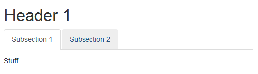

## Tabbed headers

[](tabset.html)

```markdown
Header 1 {.tabset}
==================

Subsection 1
------------
Stuff

Subsection 2
------------
Bits
```

---

### Printing lists of vectors

```{r, echo = 1}
lst <- list(letters[1:3],
            letters[4:5],
            letters[6],
            letters[7:10])
print(lst)
```

---

### Printing lists of vectors

```{r results = 'asis'}
cat(sapply(c('', lst),
  function(x) paste(x, collapse = ', ')), sep = '\n- ')
cat(sapply(c('', lst),
  function(x) paste(x, collapse = ', ')), sep = '\n1. ')
```

<!--Useful in an **rmdtools** package? e.g. `enumerate()`, `itemise()` or `listify(ordered = TRUE)`...-->

---

### Printing nice tables by default

```markdown
output:
  html_document:
    df_print: kable
```

```{r eval = FALSE}
head(iris)
```

```{r echo = FALSE}
knitr::kable(head(iris), 'html')
# As `kable` is not supported in Xaringan slides
```

---

## Errors, warnings and messages

#### Bootstrap alerts

- http://selbydavid.com/vignettes/alerts.html
- [Example document](http://selbydavid.com/vignettes/statsclustering.html)

#### testrmd package

- https://github.com/ropenscilabs/testrmd
- [Example document](https://ropenscilabs.github.io/testrmd/cranlogs_default.html)

---

## RStudio add-ins

#### Word counts with `wordcountaddin`

- <https://github.com/benmarwick/wordcountaddin>

#### Insert citations with `citr`

- <https://github.com/crsh/citr>

#### Check grammar with `write-good`

- <https://github.com/ropenscilabs/gramr>

---

## See also

#### R Markdown Cheat Sheet

- <https://www.rstudio.com/resources/cheatsheets/>

#### These slides

- <https://github.com/Selbosh/rmdtips>

--

# Thank you!